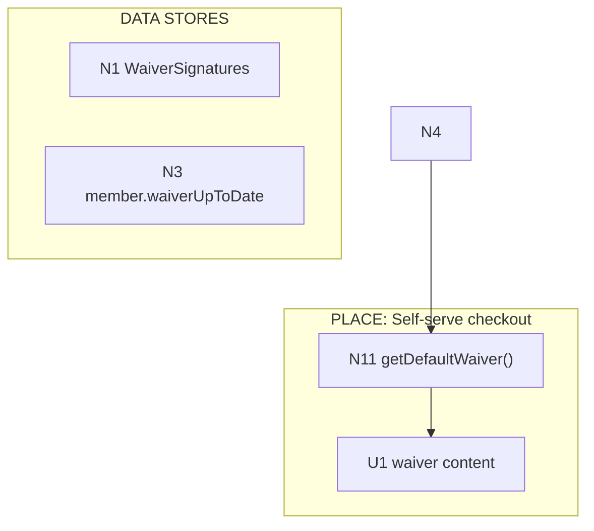
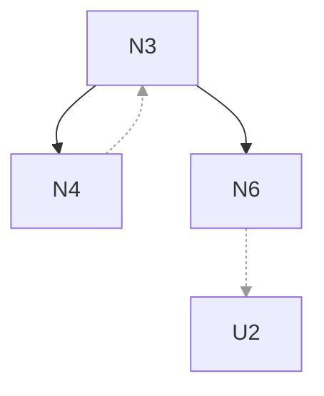
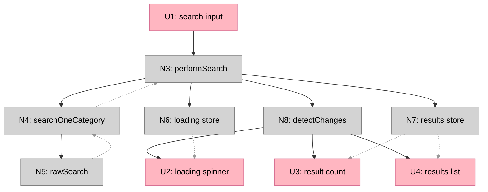
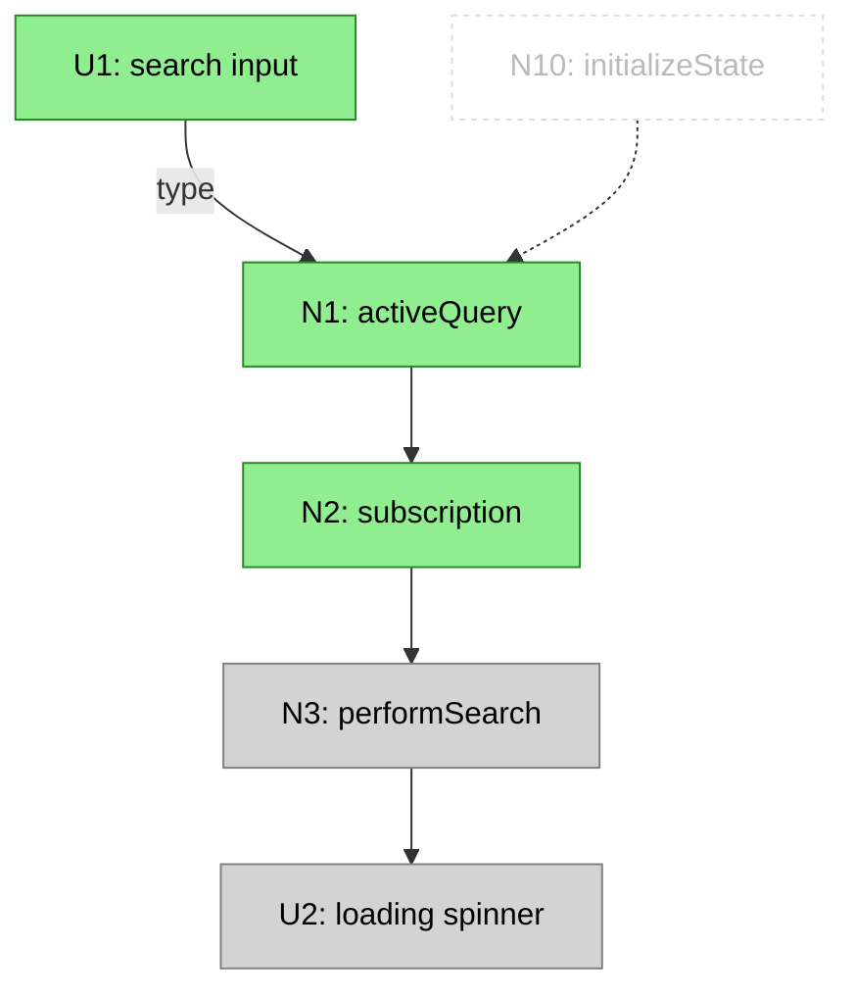

# Breadboarding Methodology

A structured approach for documenting affordances (things you can act upon) and how they wire together. Use it to:
- **Map existing code**: Trace through code to understand what exists and how it connects
- **Design from a shape**: Take a high-level shape and identify all the concrete affordances needed to implement it

## Core Concepts

### Places
A place is somewhere the user can navigate to in the UI. Each place:
- Has a route/URL the user can visit
- Contains UI affordances that are rendered there
- Is fed by non-UI affordances that produce the data for those UI affordances

All UI affordances exist within some place. When the user navigates, they move from one place to another.

### Affordances
Things you can act upon:
- **UI affordances**: inputs, buttons, displayed elements, scroll regions
- **Non-UI affordances**: methods, subscriptions, observables, data stores

### Wiring
How affordances connect to each other. There are two categories of wires:

**Wires Out** — What an affordance triggers or calls:
- **Call wires**: one affordance calls another
- **Write wires**: code writes to a data store
- **Navigation wires**: routing to a different place

**Returns To** — Where an affordance's output flows:
- **Return wires**: function returns value to its caller
- **Read wires**: data store is read by another affordance

This separation makes data flow explicit. Wires Out show control flow (what triggers what). Returns To show data flow (where output goes).

## Part A: Building the Two Tables

### Step 1: Identify the flow to analyze
Pick a specific user journey (e.g., "land on /search, type query, scroll for more, click result, click back").

### Step 2: List all places involved
Identify each distinct place the user visits during the journey. Each place typically corresponds to a route/page.

### Step 3: List all components involved
Trace through the code to find every component touched by that flow.

### Step 4: For each component, list its affordances
- UI: inputs, buttons, displayed elements, scroll regions
- Non-UI: methods, subscriptions, observables, data stores

### Step 5: For each affordance, fill in the columns

Build the table structure incrementally:

**5a. Start with a simple table**
Initial columns: Component, Inputs, Outputs

**5b. List components and indent affordances below them**
Use ↳ to show affordances belong to a component.

**5c. Identify what the affordances actually are**
Affordances are the specific things you can act upon — not abstract concepts. If you write "TYPESENSE", ask: what's the actual method? (e.g., `rawSearch()` on typesense.service)

**5d. Split Input into Control and Input Data**
- **Control**: The triggering event (click, type, call, observe, write)
- **Input Data**: The data supplied to the affordance

**5e. Fill in the Action column first**
Describe what happens — side effects, return values, calls. Don't worry about structure yet.

**5f. For UI affordances with complex actions, find the encapsulating function**
If a UI affordance's action is more than a single call, look for the function that wraps those actions. Add that function as an affordance in the Non-UI table. Then the UI affordance just wires to that single Non-UI affordance.

**5g. Use imperative tense in Action**
Write "call searchOneCategory()" not "calls searchOneCategory()".

**5h. Number the actions**
Label each action: o-1, o-2, etc. (no leading zeros).

**5i. Reference other affordances in actions**
Use → #N to show when an action triggers another affordance.

**5j. Split into two tables: UI and Non-UI**
Separating visual affordances from code affordances makes the tables clearer.

**5k. Verify against actual code**
Never invent abstractions. Every affordance name must exist in the codebase.

**5l. Rename columns for clarity**
- "Data" → "Input Data"
- "subscribe" → "observe" (control describes the trigger)

**5m. Add Wires Out column**
Extract the → #N references from Action into a separate column for reverse lookups.

**5n. Rename Output to Action**

**5o. Add Component column with (UI) or (Non-UI) label**

**5p. Add Returns To column**
For each affordance, identify where its output flows:
- Functions that return values: list the callers that receive the return (e.g., `→ N3, N12`)
- Data stores: list the affordances that read from them (e.g., `→ U2, U3`)
- Affordances with no meaningful output: use `—`

This makes data flow explicit rather than implicit.

**5q. Add data stores as affordances**
When code writes to a property that is later read by another affordance (like Angular's change detection), add that property as a data store affordance. Show write wires going in and read relationships in Input Data.

**5r. Add framework mechanisms as affordances**
Include things like `cdr.detectChanges()` that bridge between code and UI rendering. These show how state changes actually reach the UI.

**5s. For navigation, show destination directly**
When an affordance navigates to a different place, show `→ Router navigate() → #N` where #N is the destination place's main component. Don't create a central Router affordance that everything loops through.

### Step 6: Verify by reading actual code
- Never invent abstractions — every affordance name must exist in the codebase
- Check the code to understand the actual mechanism

### Final Table Structure

| Column | Description |
|--------|-------------|
| **#** | Unique ID for cross-referencing |
| **Component** | Which component owns this |
| **Affordance** | The specific thing you can act upon |
| **Control** | The triggering event: click, type, scroll, call, observe, render, iterate, write |
| **Wires Out** | What this affordance triggers: calls, writes, navigation (control flow) |
| **Returns To** | Where this affordance's output flows: return values, data store readers (data flow) |

Note: "Non-UI Affordances" can also be called "Code Affordances" for clarity.

---

## Part B: Building the Wiring Diagram

### Step 1: Build a "Wires In" lookup from the tables
Scan the Wires Out column for ALL affordances to build a reverse index showing what wires INTO each affordance.

### Step 2: Group affordances by place
Draw a labeled box for each place. All affordances belonging to that place go inside its box.

```
┌─ PLACE: Search Page (/search) ─────────────────────────────┐
│                                                            │
│  (all affordances for this place go here)                  │
│                                                            │
└────────────────────────────────────────────────────────────┘
```

### Step 3: Place each affordance exactly once
No affordance should appear twice in the diagram.

### Step 4: Draw both Wires Out and Returns To
The diagram shows two types of connections:
- **Wires Out** (solid lines): calls, triggers, writes — control flow
- **Returns To** (dashed lines): return values, data store reads — data flow

In ASCII diagrams, annotate return wires:
```
#13 performNewSearch()
         │
         ├──► #24 searchOneCategory()
         │         │
         │         ├──► #26 rawSearch()
         │         │         :
         │         │         : (returns {found, hits})
         │         ◄─ ─ ─ ─ ─┘
         │         :
         ◄─ ─ ─ ─ ─┘ (returns results)
         │
         ├──► #41 detailResult (write)
         └──► #40 cdr.detectChanges()
```

Solid arrows (`──►`) show Wires Out. Dashed arrows (`─ ─ ─`) show Returns To.

### Step 5: Show navigation between places inline
When an affordance navigates to a different place, show `Router navigate()` inline and wire directly to the destination place. Don't loop back to a central router affordance.

```
         └──► **UI #19 tile
                   │
                   └──► Router navigate()
                              │
                              ▼
┌─ PLACE: Post Detail Page ──────────────────────────────────┐
│                                                            │
│  **UI #50 post-tmpl.component                              │
│                                                            │
└────────────────────────────────────────────────────────────┘
```

### Step 6: Draw arrows for non-await wires
- Use arrows `──►` to show direction of flow for triggers, calls, and writes
- When multiple affordances wire to the same target, use notation like "◄── #27" or "(above)" to reference without duplicating

### Step 7: Mark UI affordances
Prefix UI affordances with `**UI` to distinguish them visually from Non-UI affordances.

### Step 8: Never use memory — always check the data
When tracing flows:
- To find what an affordance triggers → check its Wires Out column
- To find what triggers an affordance → scan ALL Wires Out columns for references to that #

This prevents missing paths.

---

## Part C: Mermaid Wiring Diagrams

As an alternative to ASCII diagrams, use Mermaid for wiring diagrams. Mermaid renders in GitHub, VS Code (with extensions), and https://mermaid.live.

### Basic Structure



### Line Conventions

Use solid black lines for Wires Out, dashed grey lines for Returns To:



| Line Style | Mermaid Syntax | Use |
|------------|----------------|-----|
| Solid black (`-->`) | `A --> B` | Wires Out: calls, triggers, writes |
| Dashed grey (`-.->`) | `A -.-> B` + `linkStyle N stroke:#999` | Returns To: return values, data store reads |

**Styling return wires:** After defining all links, count the indices of return wire links (0-indexed in order of definition), then add:
```
linkStyle 8,9,10 stroke:#999,stroke-width:1px
```

### Color Conventions

Use `classDef` to distinguish affordance types:

```mermaid
    classDef ui fill:#ffb6c1,stroke:#d87093,color:#000
    classDef nonui fill:#d3d3d3,stroke:#808080,color:#000
    classDef component fill:#e6e6fa,stroke:#9370db,color:#000

    class U1,U2,U3 ui
    class N1,N2,N3 nonui
    class _SIGa,_SIGb component
```

| Type | Color | Use |
|------|-------|-----|
| UI affordances | Pink (`#ffb6c1`) | Things users see/interact with |
| Code affordances | Grey (`#d3d3d3`) | Handlers, queries, data stores |
| Component references | Lavender (`#e6e6fa`) | References to reusable components |

### Reference Node Convention

Use underscore prefix (`_Name`) to distinguish references from definitions:

- `signature` = the component definition (subgraph)
- `_Signature` = a reference to that component (node)

```mermaid
    subgraph checkout["PLACE: Self-serve checkout"]
        N11["N11 getDefaultWaiver()"] --> _SIGa["_Signature"]
    end

    subgraph signature["COMPONENT: Signature"]
        N15["N15 checkSignedStatus()"]
        N15 -->|not signed| U2["U2 'Click to sign'"]
        N15 -->|signed| U15["U15 signature display"]
    end

    _SIGa -.-> signature
```

Dotted lines (`-.->`) connect references to their definitions.

### Data Flow Direction

**Writes flow INTO data stores (solid, Wires Out):**
```mermaid
N5["N5 signWaiver()"] --> N1["N1 WaiverSignatures"]
```

**Reads flow OUT of data stores (dashed, Returns To):**
```mermaid
N1["N1 WaiverSignatures"] -.-> U2["U2 signature display"]
```

This separation shows:
- Solid lines: control flow (who triggers what)
- Dashed lines: data flow (where output goes)

### Stateful Components

When multiple UI affordances are conditionally shown based on state, wrap them in a component:

```mermaid
    subgraph signature["COMPONENT: Signature"]
        N15["N15 checkSignedStatus()"]
        N15 -->|not signed| U2["U2 'Click to sign'"]
        N15 -->|signed| U15["U15 signature display"]
    end
```

The Non-UI affordance (`N15`) reads from a data store and controls which UI renders. When state changes, actions should wire back to the controlling Non-UI affordance:

```
N5["N5 signWaiver()"] --> N3
N5 --> N15
```

This shows that after signing, `N15` re-evaluates and now renders `U15` instead of `U2`.

### Subgraph Types

| Type | Label Pattern | Purpose |
|------|---------------|---------|
| Place | `PLACE: Name` | A route/page the user visits |
| Trigger | `TRIGGER: Name` | An event that kicks off a flow (not navigable) |
| Component | `COMPONENT: Name` | Reusable UI+logic that appears in multiple places |
| Data stores | `DATA STORES` | Tables and state that persist |

### Mermaid Limitations

- Nodes inside subgraphs don't naturally "stack" without edges
- Same affordance in multiple places requires unique IDs (e.g., `N11a`, `N11b`)
- Cross-subgraph wiring can cause unpredictable layouts
- Conditional rendering (like the stacking in hand-drawn diagrams) is approximated with labeled edges

---

## Breadboarding from a High-Level Shape

Use this workflow when you have a high-level shape (from shaping) and need to make it concrete by identifying all the affordances and wiring needed to implement it. This is different from mapping existing code — here you're designing what needs to exist.

### Step 1: Translate high-level shape into affordances
Take the selected shape and identify every concrete UI affordance (things users see/interact with) and Non-UI affordance (data stores, handlers, queries) needed to make it work.

### Step 2: Verify every U has a supporting N
For each UI affordance, check if there's a Non-UI affordance that provides its data or controls its rendering. If not, add the missing N.

### Step 3: Classify places as existing or new
For each UI affordance, determine whether it lives in an existing place being modified or a new place being created.

### Step 4: Apply the principle — every U needs an N to render it
A UI affordance can't appear unless something generates it. If a U has no N feeding it, either add the N or question whether the U is real.

### Step 5: Add Wires Out to each affordance
For each U and N, identify what it triggers downstream. Don't rely on memory — read each row and trace its connections.

### Step 6: Treat user-visible outputs as Us
Anything the user sees (including emails, notifications) is a UI affordance and needs to be in the U table, with an N wiring to it.

### Step 7: Check for N→N wires
Handlers often call other handlers or write to data stores. Check each N to see if it wires to other Ns.

### Step 8: Apply the principle — every N must connect
If an N has no Wires Out AND no Returns To, it's suspicious:
- **Handlers**: should have Wires Out (what they call or write)
- **Queries/functions**: should have Returns To (who receives their return value)
- **Data stores**: should have Returns To (which affordances read them)

### Step 9: Render the wiring diagram from the tables
Build the diagram by reading both columns for every row:
- **Wires Out** → solid lines (calls, triggers, writes)
- **Returns To** → dashed lines (return values, data store reads)

Group by Place. Don't use memory — let the tables drive the diagram.

---

## Key Principles

### Never use memory — always work it out by checking all the data
When tracing a flow backwards, don't follow the path you remember. Scan the Wires Out column for ALL affordances that wire to your target.

### Every affordance name must exist in the codebase
When breadboarding CURRENT code, never invent abstractions. If you write `handleSearchInput()` but the code uses `activeQuery.next()`, fix it.

### Include data stores and framework mechanisms
Data stores (like component properties) and framework mechanisms (like `detectChanges()`) are affordances too. They make the data flow explicit — showing how code changes actually reach the UI.

### Separate control flow from data flow
Use two columns in tables and two line styles in diagrams:
- **Wires Out** (solid lines): What an affordance calls, triggers, or writes to — control flow
- **Returns To** (dashed lines): Where an affordance's output flows — data flow

This makes return values and data store reads explicit rather than implicit. When N4 returns data to N3:
- N3's Wires Out shows `→ N4` (the call)
- N4's Returns To shows `→ N3` (the return)

Both directions are visible in the diagram, with solid for control and dashed for data.

### Show navigation inline, not as loops
Routing is a generic mechanism every page uses. Instead of drawing all navigation through a central Router affordance (creating confusing loops), show `Router navigate()` inline where it happens and wire directly to the destination place.

---

## Example: Wires Out vs Returns To

A simple example showing how a search flow uses both columns:

### Code Affordances

| # | Component | Affordance | Control | Wires Out | Returns To |
|---|-----------|------------|---------|-----------|------------|
| N3 | search-detail | `performSearch()` | call | → N4, → N6, → N7, → N8 | — |
| N4 | search.service | `searchOneCategory()` | call | → N5 | → N3 |
| N5 | typesense.service | `rawSearch()` | call | — | → N4 |
| N6 | search-detail | `loading` | write | data store | → U2 |
| N7 | search-detail | `results` | write | data store | → U3, U4 |
| N8 | search-detail | `detectChanges()` | call | → U2, U3, U4 | — |

### UI Affordances

| # | Component | Affordance | Control | Wires Out | Returns To |
|---|-----------|------------|---------|-----------|------------|
| U1 | search-detail | search input | type | → N3 | — |
| U2 | search-detail | loading spinner | render | — | — |
| U3 | search-detail | result count | render | — | — |
| U4 | search-detail | results list | render | — | — |

### Mermaid Diagram



**Reading the diagram:**
- Solid black lines show control flow: N3 calls N4, N4 calls N5, N3 writes to N6/N7, N8 triggers UI
- Dashed grey lines show data flow: N5 returns to N4, N4 returns to N3, stores are read by UI

---

## Extended Example (older format)

The following example uses an older table format with Input Data and Action columns. It's preserved for reference but doesn't include the Returns To column.

### UI Affordances

| # | Component | Affordance | Control | Input Data | Action | Wires Out |
|---|-----------|------------|---------|------------|--------|-----------|
| 2 | BROWSER (UI) | back button | click | | → Router navigate() → restores previous page | (restores #10) |
| 10 | search-detail.component (UI) | | render | | | |
| 11 | search-detail.component (UI) | search input | type | query | → #28 activeQuery.next(query) | #28 |
| 12 | search-detail.component (UI) | search input value | read | activeQuery.value | | |
| 14 | WINDOW (UI) | scroll | scroll to bottom | | → #38 onWindowScroll() | #38 |
| 15 | search-detail.component (UI) | loading spinner | render | reads #41.loading | | |
| 16 | search-detail.component (UI) | "no results" message | render | reads #41 | | |
| 17 | search-detail.component (UI) | result count | render | reads #41.found | | |
| 18 | content-tile.component (UI) | | render | @Input searchHit | | |
| 19 | content-tile.component (UI) | tile | click | hit.document.route | → Router navigate() → #50 post-tmpl | #50 |
| 20 | content-tile.component (UI) | cover image | render | | | |
| 21 | content-tile.component (UI) | title | render | | | |
| 22 | content-tile.component (UI) | content snippet | render | | | |
| 50 | post-tmpl.component (UI) | | render | page, widgets | display post/letter detail | |
| 51 | post-tmpl.component (UI) | title | render | page.title | | |
| 52 | post-tmpl.component (UI) | content | render | page.content | | |
| 53 | post-tmpl.component (UI) | widgets area | render | widgets | → #54 for each widget | #54 |
| 54 | widget components (UI) | | render | widget data | display widget content | |

### Non-UI Affordances

| # | Component | Affordance | Control | Input Data | Action | Wires Out |
|---|-----------|------------|---------|------------|--------|-----------|
| 6 | Router (Non-UI) | queryParams | observe | {q, category} | → #30 initializeState(params) | #30 |
| 8 | intercomService (Non-UI) | subject | observe | 'scrolled-to-the-end' | → #27 appendNextPageOfResults() | #27 |
| 9 | intercomService (Non-UI) | sendMessage() | call | message | re-arm scroll detection | |
| 39 | intercomService (Non-UI) | scrollEvents | observe | event | check if near bottom, if so → #8 subject | #8 |
| 38 | app.component (Non-UI) | onWindowScroll() | call | event | → #39 scrollEvents.next(event) | #39 |
| 28 | search-detail.component (Non-UI) | activeQuery.next() | call | query | notify #29 | #29 |
| 29 | search-detail.component (Non-UI) | activeQuery subscription | observe | query | debounce 90ms, if query.length >= 3: → #13 | #13 |
| 30 | search-detail.component (Non-UI) | initializeState() | call | params | set activeQuery, activeCategory, → #13 | #13 |
| 13 | search-detail.component (Non-UI) | performNewSearch() | call | | set loading=true, → #24 (await), write → #41, set loading=false, → #40 | #24 (await), #41, #40 |
| 27 | search-detail.component (Non-UI) | appendNextPageOfResults() | call | | increment detailPage, → #24 (await), concat hits → #41, → #9, → #40 | #24 (await), #41, #9, #40 |
| 41 | search-detail.component (Non-UI) | detailResult | write | { found, hits } | store search results | |
| 40 | search-detail.component (Non-UI) | cdr.detectChanges() | call | reads #41 | re-evaluate template bindings | #15, #16, #17, #35 |
| 35 | search-detail.component (Non-UI) | *ngFor detailResult.hits | iterate | #41.hits | render #18 for each hit | #18 |
| 24 | search.service (Non-UI) | searchOneCategory() | call | query, category, page | → #26 (await), return { found, hits } | #26 (await) |
| 26 | typesense.service (Non-UI) | rawSearch() | call | {q, filter_by, page, limit} | return { found, hits } | |

### Wiring Diagram

Each affordance appears exactly once. Nesting shows await/return patterns. Places are shown as labeled boxes.

```
┌─ PLACE: Search Page (/search) ─────────────────────────────────────────────────────────────┐
│                                                                                            │
│  **UI #10 search-detail.component                                                          │
│           │                                                                                │
│           └──► #6 Router queryParams                                                       │
│                     │                                                                      │
│                     ▼                                                                      │
│           #30 initializeState() ────────────────────────────┐                              │
│                                                             │                              │
│  **UI #11 search input                                      │                              │
│           │                                                 │                              │
│           ▼                                                 │                              │
│  #28 activeQuery.next()                                     │                              │
│           │                                                 │                              │
│           ▼                                                 │                              │
│  #29 activeQuery subscription                               │                              │
│           │                                                 │                              │
│           └─────────────────────────────────────────────────┤                              │
│                                                             ▼                              │
│                                                #13 performNewSearch()                      │
│                                                     │                                      │
│                                                     ├── #24 searchOneCategory()            │
│                                                     │       │                              │
│                                                     │       └── #26 rawSearch()            │
│                                                     │                                      │
│                                                     ├──► #41 detailResult (write)          │
│                                                     │                                      │
│                                                     └──► #40 cdr.detectChanges() ◄─────────┼───┐
│                                                               │                            │   │
│                                                               ├──► **UI #15 loading        │   │
│                                                               ├──► **UI #16 "no results"   │   │
│                                                               ├──► **UI #17 result count   │   │
│                                                               └──► #35 *ngFor              │   │
│                                                                         │                  │   │
│                                                                         ▼                  │   │
│                                                               **UI #18 content-tile        │   │
│                                                                         │                  │   │
│                                                                         ├──► **UI #20 cover│   │
│                                                                         ├──► **UI #21 title│   │
│                                                                         ├──► **UI #22 snippet  │
│                                                                         │                  │   │
│                                                                         └──► **UI #19 tile │   │
│                                                                                   │        │   │
│  **UI #14 WINDOW scroll                                                           │        │   │
│           │                                                                       │        │   │
│           ▼                                                                       │        │   │
│  #38 onWindowScroll()                                                             │        │   │
│           │                                                                       │        │   │
│           ▼                                                                       │        │   │
│  #39 scrollEvents                                                                 │        │   │
│           │                                                                       │        │   │
│           ▼                                                                       │        │   │
│  #8 subject                                                                       │        │   │
│           │                                                                       │        │   │
│           ▼                                                                       │        │   │
│  #27 appendNextPageOfResults()                                                    │        │   │
│           │                                                                       │        │   │
│           ├── #24 (above)                                                         │        │   │
│           ├──► #41 (above, write)                                                 │        │   │
│           ├──► #9 sendMessage()                                                   │        │   │
│           └──► #40 (above) ───────────────────────────────────────────────────────┼───────────┘
│                                                                                   │        │
└───────────────────────────────────────────────────────────────────────────────────┼────────┘
                                                                                    │
                                                                       Router navigate()
                                                                                    │
                                                                                    ▼
┌─ PLACE: Post Detail Page (/lama-ole/letters/{slug}) ──────────────────────────────────────┐
│                                                                                           │
│  **UI #50 post-tmpl.component                                                             │
│           │                                                                               │
│           ├──► **UI #51 title                                                             │
│           ├──► **UI #52 content                                                           │
│           └──► **UI #53 widgets area                                                      │
│                     │                                                                     │
│                     └──► **UI #54 widget components                                       │
│                                                                                           │
│  **UI #2 BROWSER back button                                                              │
│           │                                                                               │
│           └──► Router navigate() ──► (restores Search Page with query params)             │
│                                                                                           │
└───────────────────────────────────────────────────────────────────────────────────────────┘
                    │
                    ▼
          ┌────────────────────┐
          │ Search Page        │
          │ (above, restored   │
          │  via #6 queryParams)│
          └────────────────────┘
```

### Flow Description

1. **Land on Search Page**: Enter place → #10 renders → #6 queryParams → #30 → #13 → results display
2. **User types**: #11 → #28 → #29 → #13 → #24 → #26 → #41 → #40 → UI updates
3. **User scrolls**: #14 → #38 → #39 → #8 → #27 → same pattern
4. **User clicks result**: #19 tile → Router navigate() → **leave Search Page, enter Post Detail Page**
5. **Post Detail renders**: #50 → #51, #52, #53, #54
6. **User clicks back**: #2 → Router navigate() → **leave Post Detail, enter Search Page** → #6 restores state

---

## Part D: Slicing a Breadboard into Vertical Implementation Slices

Once you have a complete breadboard, use this approach to create an implementation plan with vertical slices. Each slice should be demo-able end-to-end (integrates frontend and backend).

### What is a Vertical Slice?

A **vertical slice** cuts through all layers (UI, logic, data) to deliver a working feature increment. The opposite is a **horizontal slice** — doing a bunch of work on one layer (e.g., "set up all the data models") that isn't clickable from the interface.

Good vertical slices:
- Can be demonstrated to stakeholders
- Integrate frontend and backend
- Build on previous slices incrementally

### Step 1: Identify the minimal demo-able increment

Look at your breadboard and ask: "What's the smallest subset that produces a working demo?"

Usually this is:
- The core data fetch
- Basic rendering
- No search, no pagination, no state persistence yet

### Step 2: Layer additional capabilities as slices

Each subsequent slice adds one capability:
- Search input
- Pagination/infinite scroll
- URL state persistence
- Abbreviated mode / "See all" link
- Cutover (remove old system)

Keep slices to < 10. Combine related features (e.g., "abbreviated mode" and "see all link" belong together — one without the other isn't useful).

### Step 3: Assign affordances to slices

Go through every affordance in your tables and assign it to a slice. Create a mapping:

| Slice | Affordances |
|-------|-------------|
| V1 | U2, U3, U4, U5, U6-U9, N3-N8 |
| V2 | U1, N1, N2 |
| V3 | U10, N11, N12, N13 |
| ... | ... |

### Step 4: Create per-slice affordance tables

For each slice, extract just the affordances being added in that slice:

**V2: Search Works**

| # | Component | Affordance | Control | Wires Out | Returns To |
|---|-----------|------------|---------|-----------|------------|
| U1 | letter-browser | search input | type | → N1 | — |
| N1 | letter-browser | `activeQuery` | BehaviorSubject | → N2 | — |
| N2 | letter-browser | `activeQuery` subscription | observe | → N3 | — |

### Step 5: Create per-slice wiring diagrams with scope visualization

This is the key technique: **show the complete breadboard in every slice diagram**, but use styling to distinguish:

| Category | Style | Mermaid classDef |
|----------|-------|------------------|
| **This slice** (in scope) | Bright color (green/blue/purple/gold) | `fill:#90EE90,stroke:#228B22,color:#000` |
| **Already built** (previous slices) | Solid grey | `fill:#d3d3d3,stroke:#808080,color:#000` |
| **Future** (not yet built) | Transparent, dashed | `fill:none,stroke:#ddd,color:#bbb,stroke-dasharray:3 3` |

Example for V2 (Search Works):



**Legend:**
- **Green** = V2 scope (this slice)
- **Grey** = Already built (V1)
- **Transparent (dashed)** = Future slices

### Step 6: Use consistent colors across slices

Pick a color for each slice and use it consistently:

| Slice | Color | Hex |
|-------|-------|-----|
| V1 | Green | `#90EE90` |
| V2 | Green | `#90EE90` |
| V3 | Blue | `#87CEEB` |
| V4 | Purple | `#DDA0DD` |
| V5 | Gold | `#FFD700` |

### Step 7: Write demo scripts for each slice

Each slice section should end with a concrete demo script:

**Demo (V2):**
Type "dharma" in search box. After 90ms debounce, results filter to matching letters.

### Complete Slices Document Structure

```markdown
# Feature Name: Implementation Slices

## Slice Overview

| # | Slice | Backend | Frontend | Demo |
|---|-------|---------|----------|------|
| V1 | Widget with real data | ... | ... | "Widget shows real data" |
| V2 | Search works | — | ... | "Type to filter" |
| ... | ... | ... | ... | ... |

---

## V1: Widget with Real Data

### Backend
- ...

### Frontend
- ...

### UI Affordances (V1)
| # | Component | Affordance | Control | Wires Out | Returns To |
...

### Code Affordances (V1)
...

### Wiring Diagram (V1)
```mermaid
(complete diagram with V1 highlighted, future transparent)
```

### Demo (V1)
...

---

## V2: Search Works
...
```

### Why This Visualization Works

1. **Context preserved**: Seeing the whole system in every slice helps understand where the new work fits
2. **Progress visible**: Grey "already built" nodes show accumulating progress
3. **Scope clear**: Highlighted nodes make the current slice's boundaries unambiguous
4. **Future visible**: Transparent nodes show what's coming without distraction
5. **No duplication**: Same diagram structure, just different highlighting
